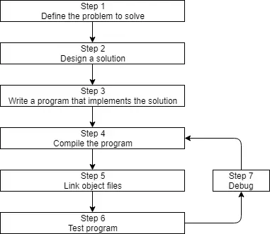
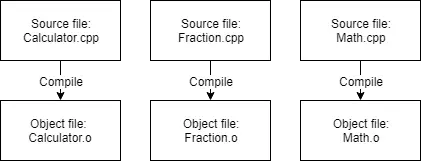
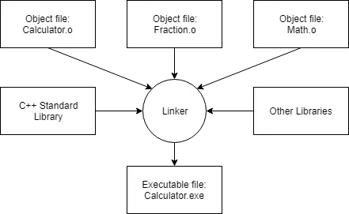
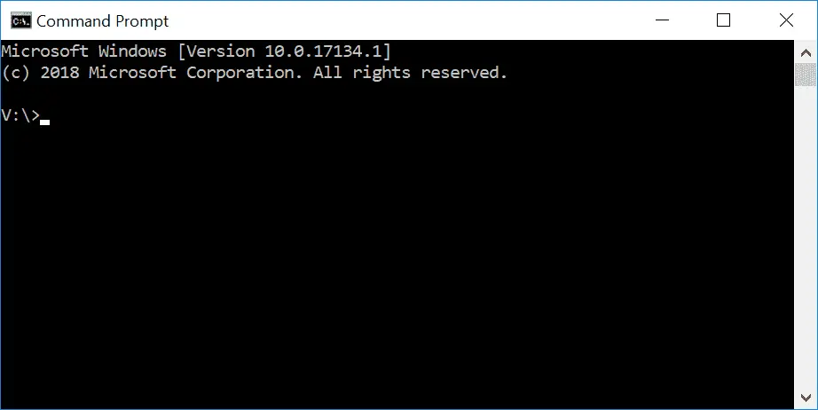

## Introduzione allo sviluppo in C++
===============================


Prima di poter scrivere ed eseguire il nostro primo programma C++, dobbiamo capire più nel dettaglio come vengono sviluppati i programmi C++. Ecco un grafico che illustra un approccio semplicistico:



### Passo 1: Definire il problema che si desidera risolvere

Questa è la fase del "cosa", in cui si capisce quale problema si intende risolvere. L'idea iniziale di ciò che si vuole programmare può essere il passo più facile o più difficile. Ma concettualmente è il più semplice. Basta un'idea che possa essere ben definita e si è pronti per il passo successivo.

Ecco alcuni esempi:

- "Voglio scrivere un programma che mi permetta di inserire molti numeri e che calcoli la media".
- Voglio scrivere un programma che generi un labirinto in 2d e permetta all'utente di attraversarlo. L'utente vince se raggiunge la fine".
- Voglio scrivere un programma che legga un file con i prezzi delle azioni e preveda se le azioni saliranno o scenderanno".

### Fase 2: stabilire come risolvere il problema

Questa è la fase del "come", in cui si stabilisce come risolvere il problema proposto nella fase 1. È anche la fase più difficile da gestire. È anche la fase più trascurata nello sviluppo del software. Il nocciolo della questione è che ci sono molti modi per risolvere un problema, ma alcune di queste soluzioni sono migliori e altre peggiori. Troppo spesso abbiamo un'idea, ci sediamo e proviamo immediatamente a scrivere codice. Questo spesso genera una soluzione che rientra nella categoria delle cattive soluzioni.

In genere, le soluzioni valide hanno le seguenti caratteristiche:

- Sono semplici (non eccessivamente complicate o confuse).
- Sono ben documentate (soprattutto per quanto riguarda le ipotesi o le limitazioni).
- Sono costruite in modo modulare, in modo che le parti possano essere riutilizzate o modificate in seguito senza impattare su altre parti del programma.
- Sono robusti e possono recuperare o fornire messaggi di errore utili quando accade qualcosa di inaspettato.

Quando ci si siede e si inizia subito a programmare, di solito si pensa "voglio fare <qualcosa>", quindi si implementa la soluzione più veloce. Questo può portare a programmi fragili, difficili da modificare o estendere in seguito, o con molti bug.

Per inciso...

Il termine *bug* è stato usato per la prima volta da Thomas Edison nel 1870! Tuttavia, il termine è stato reso popolare negli anni '40 quando gli ingegneri trovarono una vera falena incastrata nell'hardware di un primo computer, causando un cortocircuito. Sia il registro in cui fu segnalato l'errore sia la falena fanno ora parte dello Smithsonian Museum of American History. È possibile consultarlo [qui] (https://americanhistory.si.edu/collections/search/object/nmah_334663).

Alcuni studi hanno dimostrato che solo il 20% del tempo di un programmatore viene effettivamente dedicato alla scrittura del programma iniziale. Il restante 80% è dedicato alla manutenzione, che può consistere nel debugging (eliminazione dei bug), negli aggiornamenti per far fronte ai cambiamenti dell'ambiente (ad esempio per funzionare su una nuova versione del sistema operativo), nei miglioramenti (piccole modifiche per migliorare l'usabilità o la capacità) o nei miglioramenti interni (per aumentare l'affidabilità o la manutenibilità).

Di conseguenza, vale la pena spendere un po' di tempo in più in anticipo (prima di iniziare la codifica) per pensare al modo migliore di affrontare un problema, alle ipotesi che si stanno facendo e a come si potrebbe pianificare il futuro, in modo da risparmiarsi molto tempo e problemi in futuro.

---
### Passo 3: scrivere il programma

I programmi che scriviamo utilizzando le istruzioni in C++ sono chiamati codice sorgente (spesso abbreviato in codice). È possibile scrivere un programma utilizzando qualsiasi editor di testo, anche un semplice blocco note di Windows o vi o pico di Unix. 

```
#include <iostream>

int main()
{
    std::cout << "Testo colorato!";
    return 0;
}
```


I programmi che si scrivono si chiamano in genere *qualcosa.cpp*, dove *qualcosa* è sostituito dal nome che si sceglie per il programma (ad esempio, calcolatrice, hi-lo, ecc.). L'estensione *.cpp* indica al compilatore (e a voi) che si tratta di un file di codice sorgente C++ che contiene istruzioni C++. Si noti che alcuni usano l'estensione .cc invece di .cpp, ma si consiglia di usare .cpp.

> **Best practice**

Nominare i file di codice *qualcosa.cpp*, dove *qualcosa* è un nome a vostra scelta e *.cpp* è l'estensione che indica che il file è un file sorgente C++.

Si noti inoltre che molti programmi C++ complessi hanno più file .cpp. Anche se la maggior parte dei programmi che creerete inizialmente avrà un solo file .cpp, è possibile scrivere programmi singoli con decine o centinaia di file .cpp.

Una volta scritto il nostro programma, i passi successivi consistono nel convertire il codice sorgente in qualcosa di eseguibile e nel verificare se se funziona.


---------------

## Introduzione a compilatore, linker e librerie

---------------


Discutiamo i passi da 4 a 7.

### Passo 4: Compilazione del codice sorgente

Per compilare un programma C++, si utilizza un compilatore C++. Il compilatore C++ esamina in sequenza ogni file di codice sorgente (.cpp) del programma e svolge due compiti importanti:

1) Innanzitutto, controlla il codice per verificare che segua le regole del linguaggio C++. In caso contrario, il compilatore segnala un errore (e il numero di riga corrispondente) per aiutare a individuare gli elementi da correggere. Il processo di compilazione viene interrotto finché l'errore non viene risolto.

In secondo luogo, traduce il codice sorgente C++ in un file di linguaggio macchina chiamato file oggetto (object file). I file oggetto sono in genere denominati *nome.o* o *nome.obj*, dove *nome* è lo stesso nome del file .cpp da cui è stato prodotto.

Se il programma ha 3 file .cpp, il compilatore genera 3 file oggetto:




I compilatori C++ sono disponibili per molti sistemi operativi diversi. L'installazione di un compilatore verrà discussa a breve, quindi non è necessario farlo ora.

### Passo 5: Collegamento dei file oggetto e delle librerie

Dopo che il compilatore ha creato uno o più file oggetto, entra in gioco un altro programma chiamato **linker**. Il compito del `linker` è triplice:

1) Primo, prendere tutti i file oggetto generati dal compilatore e combinarli in un unico programma eseguibile.




2) In secondo luogo, oltre a poter collegare i file oggetto, il `linker` è anche in grado di collegare i **file di libreria**. Un file di libreria è una raccolta di codice precompilato che è stato "impacchettato" per essere riutilizzato in altri programmi.

Il nucleo del linguaggio C++ è in realtà piuttosto piccolo e conciso (e in queste esercitazioni ne imparerete molto). Tuttavia, il C++ è dotato di un'ampia libreria chiamata C++ Standard Library (solitamente abbreviata in *standard library*) che fornisce funzionalità aggiuntive che possono essere utilizzate nei programmi. Una delle parti più comunemente utilizzate della libreria standard del C++ è la libreria *iostream*, che contiene funzionalità per la stampa di testo su un monitor e per ricevere input da tastiera da un utente. Quasi ogni programma C++ scritto utilizza la libreria standard in qualche forma, quindi è molto comune che la libreria standard venga collegata ai programmi. La maggior parte dei `linker` collega automaticamente la libreria standard non appena se ne utilizza una parte, quindi in genere non è un problema di cui preoccuparsi.

È anche possibile collegare facoltativamente altre librerie. Per esempio, se dovessimo scrivere un programma che riproduce suoni, probabilmente non vorremmo scrivere noi il codice per leggere i file sonori dal disco, controllare che siano validi o capire come indirizzare i dati sonori al sistema operativo o all'hardware per riprodurli attraverso l'altoparlante... sarebbe un sacco di lavoro inutile. Invece, probabilmente scaricheremo una libreria che sa già come fare queste cose e la userete. Parleremo di come collegare le librerie (e crearne di proprie) nell'appendice.

In terzo luogo, il linker si assicura che tutte le dipendenze tra file siano risolte correttamente. Ad esempio, se si definisce qualcosa in un file .cpp e poi lo si usa in un altro file .cpp, il linker collega i due file. Se il linker non è in grado di collegare un riferimento a qualcosa con la sua definizione, si otterrà un errore del linker e il processo di collegamento verrà interrotto.

Una volta che il linker ha finito di collegare tutti i file oggetto e le librerie (supponendo che tutto vada bene), si avrà un file eseguibile che potrà essere eseguito.


Per progetti complessi, alcuni ambienti di sviluppo utilizzano un **makefile**, ovvero un file che descrive come costruire un programma (ad esempio quali file compilare e collegare, o comunque elaborare in vari modi). Sono stati scritti interi libri su come scrivere e mantenere i makefile, che possono essere uno strumento incredibilmente potente. Tuttavia, poiché i makefile non fanno parte del nucleo del linguaggio C++ e non è necessario utilizzarli per procedere nello studio di C++, ne parleremo più avanti.

### Passi 6 e 7: test e debug

Questa è la parte più divertente (si spera). Possiamo eseguire il nostro eseguibile e vedere se produce l'output che ci aspettiamo.

Se il programma viene eseguito ma non funziona correttamente, è il momento di eseguire il debug per capire cosa c'è che non va. Parleremo presto di come testare i programmi e di come eseguirne il debug in modo più dettagliato.


---------------

## Ambienti di sviluppo integrati (IDE)

---------------
**Creare Progetti nell'IDE**

Per scrivere un programma C++ all'interno di un IDE, di solito si inizia creando un nuovo progetto. Un progetto è un contenitore che contiene tutti i file di codice sorgente, le immagini, i file di dati, ecc... necessari per produrre un eseguibile (o una libreria, un sito web, ecc...) da eseguire o utilizzare. Il progetto salva anche varie impostazioni dell'IDE, del compilatore e del linker, oltre a ricordare il punto in cui si è lasciato, in modo che quando si riapre il progetto in un secondo momento, lo stato dell'IDE può essere ripristinato al punto in cui si era lasciato. Quando si sceglie di compilare il programma, tutti i file .cpp del progetto vengono compilati e collegati.

Ogni progetto corrisponde a un programma. Quando si è pronti a creare un secondo programma, è necessario creare un nuovo progetto o sovrascrivere il codice di un progetto esistente (se non lo si vuole conservare). I file di progetto sono generalmente specifici per l'IDE, quindi un progetto creato per un IDE dovrà essere ricreato in un IDE diverso.

**Best practise**

> Creare un nuovo progetto per ogni nuovo programma scritto.

---
### Progetti via console

Quando si crea un nuovo progetto, generalmente viene chiesto quale tipo di progetto si vuole creare. Tutti i progetti che creeremo in questo tutorial saranno `progetti console`. Un progetto console significa che creeremo programmi che possono essere eseguiti dalla console di Windows, Linux o Mac.

Ecco una schermata della console di Windows:




Per impostazione predefinita, le applicazioni per console non hanno un'interfaccia grafica (GUI), stampano testo sulla console, leggono input dalla tastiera e sono compilate in file eseguibili autonomi. Questo è perfetto per imparare il C++, perché mantiene la complessità al minimo e garantisce il funzionamento su un'ampia gamma di sistemi.

Non preoccupatevi se non avete mai usato una console o se non sapete come accedervi. Compileremo e lanceremo i nostri programmi attraverso i nostri IDE (che richiameranno la console quando necessario).

### Workspace / Solutions

Quando si crea un nuovo progetto per il proprio programma, molti IDE aggiungono automaticamente il progetto a un "workspace" o a una "solution" (il termine varia a seconda dell'IDE). Uno spazio di lavoro o una soluzione è un contenitore che può contenere uno o più progetti correlati. Ad esempio, se si sta scrivendo un videogame e si vuole avere un eseguibile separato per il giocatore singolo e per il multigiocatore, è necessario creare due progetti. Non avrebbe senso che entrambi i progetti fossero completamente indipendenti: dopo tutto, fanno parte dello stesso gioco. Molto probabilmente, ognuno di essi sarà configurato come progetto separato all'interno di un singolo spazio di lavoro/soluzione.

---
Anche se è possibile aggiungere più progetti a una singola soluzione, in genere si consiglia di creare un nuovo spazio di lavoro o una nuova soluzione per ogni programma, soprattutto durante l'apprendimento. È più semplice e ci sono meno possibilità che qualcosa vada storto.


---

### Hello World
Ora creiamo un nuovo file chiamato helloworld.cpp e incolliamo questo codice sorgente:
```
#include <iostream>

int main()
{
	std::cout << "Hello, world!";
	return 0;
}
```


Ora compiliamo con il compiler installato (ad esempio MYI2 su VSCODE). Verra' creato un file .exe che potremmo eseguire anche in console.


----


## Differenze tra le opzioni compile, build, rebuild, clean e run/start nel mio IDE

Prima abbiamo visto come per produrre un file eseguibile, ogni file di codice di un programma viene compilato in un file oggetto e poi i file oggetto vengono collegati in un eseguibile.

Quando un file di codice viene compilato, l'IDE può memorizzare il file oggetto risultante. In questo modo, se il programma viene compilato di nuovo in futuro, qualsiasi file di codice che non è stato modificato non deve essere ricompilato: il file oggetto memorizzato nella cache dall'ultima volta può essere riutilizzato. Questo può accelerare notevolmente i tempi di compilazione (al costo di un po' di spazio su disco).

Con questo in mente, ecco cosa fa di solito ciascuna delle opzioni:

- **Build** compila tutti i file di codice *modificati* nel progetto o nell'area di lavoro/soluzione, quindi collega i file oggetto in un eseguibile. Se nessun file di codice è stato modificato dall'ultima compilazione, questa opzione non fa nulla.
- **Clean** rimuove tutti gli oggetti e gli eseguibili memorizzati nella cache, in modo che alla successiva compilazione del progetto tutti i file vengano ricompilati e venga prodotto un nuovo eseguibile.
- **Rebuild** esegue una "pulizia", seguita da una "compilazione".
- **Compile** ricompila un singolo file di codice (indipendentemente dal fatto che sia stato memorizzato nella cache in precedenza). Questa opzione non richiama il linker né produce un eseguibile.
- **Run/start** esegue l'eseguibile di una precedente compilazione. Alcuni IDE (ad esempio Visual Studio) invocano un "build" prima di eseguire un "run", per assicurarsi di eseguire l'ultima versione del codice. Altri (ad esempio Code::Blocks) eseguono semplicemente l'eseguibile precedente.

Anche se parliamo informalmente di "compilazione" dei nostri programmi, per compilarli effettivamente scegliamo l'opzione "build" (o "run") nel nostro IDE.


---
## Configurazione del compilatore

Una configurazione di compilazione (chiamata anche target di compilazione) è un insieme di impostazioni del progetto che determina il modo in cui l'IDE costruirà il progetto. La configurazione di compilazione include tipicamente elementi come il nome dell'eseguibile, le directory in cui l'IDE cercherà altri file di codice e di libreria, se mantenere o eliminare le informazioni di debug, quanto ottimizzare il programma da parte del compilatore, ecc. In genere, si consiglia di lasciare queste impostazioni ai valori predefiniti, a meno che non ci sia una ragione specifica per cambiare qualcosa.

Quando si crea un nuovo progetto nell'IDE, la maggior parte degli IDE imposta due diverse configurazioni di compilazione: una configurazione di rilascio e una configurazione di debug.

**La configurazione di debug** è progettata per aiutare l'utente a eseguire il debug del programma ed è generalmente quella che si usa quando si scrivono i programmi. Questa configurazione disattiva tutte le ottimizzazioni e include le informazioni di debug, rendendo i programmi più grandi e più lenti, ma molto più facili da debuggare. La configurazione di debug è di solito selezionata come configurazione attiva per impostazione predefinita. Parleremo meglio delle tecniche di debug in una lezione successiva.

**La configurazione release** è pensata per essere usata quando si rilascia il programma al pubblico. Questa versione è tipicamente ottimizzata per le dimensioni e le prestazioni e non contiene le informazioni di debug aggiuntive. Poiché la configurazione di rilascio include tutte le ottimizzazioni, questa modalità è utile anche per testare le prestazioni del codice (cosa che verrà mostrata più avanti nella serie di esercitazioni).

Se ad esempio prendessimo il programma *Hello World* costruito con Visual Studio, l'eseguibile prodotto nella configurazione di debug sarebbe di 65kb, mentre l'eseguibile costruito nella versione di rilascio di 12kb. La differenza è in gran parte dovuta alle informazioni di debug in più conservate nella build di debug.

Anche se è possibile creare configurazioni di compilazione personalizzate, raramente se ne ha motivo, a meno che non si vogliano confrontare due compilazioni realizzate con impostazioni diverse del compilatore.

> **La best practise**: Durante lo sviluppo dei programmi, utilizzare la configurazione di compilazione *debug*. Quando si è pronti a rilasciare l'eseguibile ad altri o si vogliono testare le prestazioni, utilizzare la configurazione di compilazione *release*.


==============================================

## Estensioni del compilatore

Lo standard C++ definisce le regole su come i programmi devono comportarsi in determinate circostanze. Nella maggior parte dei casi, i compilatori seguono queste regole. Tuttavia, molti compilatori implementano le proprie modifiche al linguaggio, spesso per migliorare la compatibilità con altre versioni o per ragioni storiche. Questi comportamenti specifici del compilatore sono chiamati *estensioni del compilatore*.

La scrittura di un programma che fa uso di un'estensione del compilatore consente di scrivere programmi incompatibili con lo standard C++. I programmi che utilizzano estensioni non standard generalmente non vengono compilati da altri compilatori (che non supportano le stesse estensioni) o, se lo fanno, potrebbero non essere eseguiti correttamente.

È frustrante che le estensioni del compilatore siano spesso abilitate per impostazione predefinita. Questo è particolarmente dannoso per i nuovi programmatori, che possono pensare che un comportamento che funziona faccia parte dello standard ufficiale di C++, mentre in realtà il loro compilatore è semplicemente troppo permissivo.

Poiché le estensioni del compilatore non sono mai necessarie e causano la non conformità dei programmi agli standard C++, si consiglia di disattivare le estensioni del compilatore.

> Best practise: Disattivare le estensioni del compilatore per garantire che i programmi (e le pratiche di codifica) siano conformi agli standard C++ e funzionino su qualsiasi sistema.

----

## Configurare il compilatore: scegliere uno standard di linguaggio
=======================================================


Con molte versioni diverse di C++ disponibili (C++98, C++03, C++11, C++14, C++17, C++20, ecc...) come fa il vostro compilatore a sapere quale usare? In genere, un compilatore sceglie uno standard di default (in genere *non* lo standard linguistico più recente).

Se si desidera utilizzare uno standard diverso (e probabilmente lo si farà), si dovrà configurare l'IDE/compilatore per farlo.

### Nomi di codice per gli standard linguistici in corso

Gli standard linguistici finalizzati prendono il nome dagli anni in cui sono stati finalizzati (ad esempio, C++17 è stato finalizzato nel 2017).

Tuttavia, quando si sta concordando un nuovo standard linguistico, non è chiaro in quale anno avverrà la finalizzazione. Di conseguenza, agli standard linguistici in corso d'opera vengono assegnati nomi di codice, che vengono poi sostituiti dai nomi effettivi al momento della finalizzazione dello standard. Ad esempio, *C++11* era chiamato *c++1x* mentre era in lavorazione. È possibile che i nomi di codice siano ancora utilizzati (soprattutto per le prossime versioni dello standard del linguaggio, che non avranno ancora un nome definitivo).

Ecco una mappatura dei nomi di codice con i nomi finali:

- c++1x = C++11
- c++1y = C++14
- c++1z = C++17
- c++2a = C++20
- c++2b = C++23

Ad esempio, se si vede `c++1z`, questo è sinonimo dello standard linguistico C++17.

### Quale standard linguistico scegliere?

Negli ambienti professionali, è comune scegliere uno standard di linguaggio che sia una o due versioni indietro rispetto allo standard più recente (ad esempio, se C++20 è l'ultima versione, significa C++14 o C++17). In genere questo viene fatto per garantire che i produttori di compilatori abbiano avuto la possibilità di risolvere i difetti e che le migliori pratiche per le nuove funzionalità siano ben comprese. Se pertinente, questo aiuta anche a garantire una migliore compatibilità multipiattaforma, dato che i compilatori su alcune piattaforme potrebbero non fornire immediatamente il pieno supporto ai nuovi standard linguistici.

Per i progetti personali e per l'apprendimento non ci sono molti svantaggi nello scegliere l'ultimo standard finalizzato (al momento in cui scriviamo, attualmente il C++20).


------------------

## CAPITOLO 1

------------------

## Le dichiarazioni

Un programma per computer è una sequenza di istruzioni che indicano al computer cosa fare. Un'istruzione è un tipo di istruzione che induce il programma a *eseguire un'azione*.

Gli `statement` sono di gran lunga il tipo di istruzione più comune in un programma C++. Questo perché sono la più piccola unità di calcolo indipendente del linguaggio C++. In questo senso, si comportano come le frasi nel linguaggio naturale. Quando vogliamo trasmettere un'idea a un'altra persona, di solito scriviamo o parliamo per frasi (non per parole o sillabe a caso). In C++, quando vogliamo che il nostro programma faccia qualcosa, di solito scriviamo dichiarazioni.

La maggior parte delle istruzioni (ma non tutte) in C++ terminano con un punto e virgola. Se si vede una riga che termina con un punto e virgola, probabilmente si tratta di un'istruzione.

In un linguaggio di alto livello come il C++, una singola istruzione può essere compilata in molte istruzioni del linguaggio macchina.

In C++ esistono diversi tipi di istruzioni:

1.  Dichiarazioni
2.  Dichiarazioni di salto
3.  Dichiarazioni di espressione
4.  Dichiarazioni composte
5.  Dichiarazioni di selezione (condizionali)
6.  Dichiarazioni di iterazione (loop)
7.  Blocchi di prova


## Funzioni e funzione principale

In C++, le istruzioni sono tipicamente raggruppate in unità chiamate `funzioni`. Una funzione è un **insieme di istruzioni** che vengono eseguite in sequenza (in ordine, dall'alto verso il basso). 

### Regola

Ogni programma C++ deve avere una funzione speciale chiamata `main` (tutte lettere minuscole). Quando il programma viene eseguito, le istruzioni contenute in *main* vengono eseguite in ordine sequenziale.

In genere, i programmi terminano (finiscono di funzionare) dopo che è stata eseguita l'ultima istruzione all'interno della funzione *main* (anche se in alcune circostanze i programmi possono interrompersi prima, o fare un po' di pulizia in seguito).

Le funzioni sono tipicamente scritte per svolgere un lavoro specifico. Ad esempio, una funzione denominata "max" potrebbe contenere istruzioni per determinare quale dei due numeri è più grande. Una funzione chiamata `calculateGrade` potrebbe calcolare il voto di uno studente a partire da un insieme di punteggi di un test. 


Quando si parla di funzioni, è abbastanza comune aggiungere una coppia di parentesi alla fine del nome della funzione. Ad esempio, se si vede il termine *main()* o *doSomething()*, si tratta di funzioni denominate rispettivamente *main* o *doSomething*. Questo aiuta a differenziare le funzioni da altre cose con un nome (come le variabili) senza dover scrivere ogni volta la parola "funzione".


Ora che abbiamo una breve comprensione di cosa sono le dichiarazioni e le funzioni, torniamo al nostro programma "Hello world" e diamo uno sguardo di alto livello a ciò che ogni riga fa in modo più dettagliato.

```
#include <iostream>

int main()
{
   std::cout << "Hello world!";
   return 0;
}
```

La riga 1 è un tipo speciale di riga chiamata `direttiva del preprocessore`. Questa direttiva del preprocessore indica che vogliamo usare il contenuto della libreria `iostream`, che è la parte della libreria standard del C++ che ci permette di leggere e scrivere testo da/verso la console. Questa riga è necessaria per poter utilizzare `std::cout` alla riga 5. Escludendo questa riga si otterrebbe un errore di compilazione alla riga 5, poiché altrimenti il compilatore non saprebbe cosa sia `std::cout`.

La riga 2 è vuota e viene ignorata dal compilatore. Questa riga esiste solo per rendere il programma più leggibile all'uomo (separando la direttiva del preprocessore #include dalle parti successive del programma).

La riga 3 indica al compilatore che stiamo per scrivere (definire) una funzione chiamata *main*. Come abbiamo detto in precedenza, ogni programma C++ deve avere una funzione *main*, altrimenti non riuscirà a collegarsi.

Le righe 4 e 7 indicano al compilatore quali righe fanno parte della funzione *main*. Tutto ciò che è compreso tra la parentesi graffa di apertura della riga 4 e la parentesi graffa di chiusura della riga 7 è considerato parte della funzione *main*. Questo viene chiamato corpo della funzione.

La riga 5 è la prima istruzione all'interno della funzione *main* ed è la prima istruzione che verrà eseguita quando verrà eseguito il programma. L'operatore *std::cout* (che sta per "output di caratteri") e l'operatore `<<` ci permettono di inviare lettere o numeri alla console per l'output. In questo caso, stiamo inviando il testo "Hello world!", che sarà inviato alla console. Questa istruzione crea l'output visibile del programma.

La riga 6 è un'istruzione di ritorno. Quando un programma eseguibile termina l'esecuzione, il programma invia un valore al sistema operativo per indicare se l'esecuzione è andata a buon fine o meno. Questa particolare istruzione `return` restituisce al sistema operativo il valore `0`, che significa che tutto è andato bene. Questa è l'ultima istruzione del programma che viene eseguita.

Tutti i programmi che scriviamo seguiranno questo modello generale, o una sua variante.

## Sintassi ed errori di sintassi

Le regole che governano la costruzione delle frasi in una lingua si chiamano sintassi.

Anche il C++ ha una sintassi: regole su come i programmi devono essere costruiti per essere considerati validi. Quando si compila il programma, il compilatore ha il compito di verificare che il programma segua la sintassi di base del linguaggio C++. Se si viola una regola, il compilatore ci avvisa quando si cerca di compilare il programma e segnala un errore di sintassi.

Vediamo cosa succede se omettiamo il punto e virgola alla riga 5 del programma "Hello world", in questo modo:

```
#include <iostream>

int main()
{
   std::cout << "Hello world!"
   return 0;
}
```

Visual Studio produce il seguente errore (il vostro compilatore potrebbe generare un messaggio di errore con una formulazione diversa):

c:\vcprojects\test1.cpp(6): errore C2143: errore di sintassi : manca ';' prima di 'return'

Questo indica un errore di sintassi alla riga 6: il compilatore si aspettava un punto e virgola prima dell'istruzione `return`, ma non l'ha trovato. Sebbene il compilatore indichi la riga di codice che stava compilando quando ha riscontrato l'errore di sintassi, l'omissione potrebbe trovarsi in una riga precedente. In questo caso, l'errore si trova alla fine della riga 5 (il compilatore ha scoperto il problema solo alla riga 6).

Gli errori di sintassi sono comuni quando si scrive un programma. Fortunatamente, sono in genere facili da trovare e da correggere, poiché il compilatore in genere li indica subito. La compilazione di un programma sarà completata solo quando tutti gli errori di sintassi saranno stati risolti.


========
## Commenti
========

Un commento è una nota leggibile dal programmatore che viene inserita direttamente nel codice sorgente del programma. I commenti vengono ignorati dal compilatore e sono ad uso esclusivo del programmatore.

In C++ esistono due diversi stili di commenti, che hanno entrambi lo stesso scopo: aiutare i programmatori a documentare il codice in qualche modo.

### Commenti a riga singola

Il simbolo `//` inizia un commento a riga singola in C++, che indica al compilatore di ignorare tutto ciò che va dal simbolo `//` alla fine della riga. Ad esempio:

```
std::cout << "Hello world!"; // Tutto ciò che va da qui alla fine della riga viene ignorato
```


In genere, il commento a riga singola viene utilizzato per fare un rapido commento su una singola riga di codice.

```
std::cout << "Hello world!\n"; // std::cout vive nella libreria iostream
std::cout << "È un piacere conoscerti!\n"; // questi commenti rendono il codice difficile da leggere
std::cout << "Yeah!\n"; // specialmente quando le righe sono di lunghezza diversa
```


La presenza di commenti a destra di una riga può rendere difficile la lettura sia del codice che del commento, soprattutto se la riga è lunga. Se le righe sono abbastanza corte, i commenti possono essere semplicemente allineati (di solito a un punto di tabulazione).

Tuttavia, se le righe sono lunghe, inserire i commenti a destra può rendere le righe molto lunghe. In questo caso, i commenti a riga singola sono spesso posizionati sopra la riga che si sta commentando:

```
// std::cout vive nella libreria iostream
std::cout << "Hello world!\n";

// questo è molto più facile da leggere
std::cout << "È un piacere conoscerti!\n";

// non lo pensate anche voi?
std::cout << "Sì!\n";
```


Le affermazioni qui sopra rappresentano uno dei primi incontri con gli snippet di codice. Poiché gli snippet non sono programmi completi, non possono essere compilati da soli. Esistono piuttosto per dimostrare concetti specifici in modo conciso.

Se si desidera compilare uno snippet, è necessario trasformarlo in un programma completo per poterlo compilare. In genere, il programma avrà un aspetto simile a questo:

```
#include <iostream>

int main()
{
    // frammento di codice che si desidera compilare

    return 0;
}
```


### Commenti multilinea

La coppia di simboli `/*` e `*/` denota un commento su più righe in stile C. Tutto ciò che è compreso tra i due simboli viene ignorato.

```
/* Questo è un commento multilinea.
   Questa riga verrà ignorata.
   Anche questa. */
```

Poiché tutto ciò che è compreso tra i simboli viene ignorato, a volte si vedono programmatori che "abbelliscono" i loro commenti su più righe:

```
/* Questo è un commento multilinea.
 * gli asterischi corrispondenti a sinistra
 * possono rendere più facile la lettura
 */
```

> Tips: In genere, i commenti dovrebbero essere usati per tre cose. In primo luogo, per una data libreria, programma o funzione, i commenti sono meglio utilizzati per descrivere **cosa** fa la libreria, il programma o la funzione. In genere sono collocati all'inizio del file o della libreria, o immediatamente prima della funzione.

Esempio: 

```
// Questo programma calcola il voto finale dello studente in base ai punteggi dei test e dei compiti.
```

```
// Questa funzione utilizza il metodo di Newton per approssimare la radice di un'equazione data.
```

```
// Le righe seguenti generano un oggetto casuale in base alla rarità, al livello e a un fattore di peso.
```

Tutti questi commenti danno al lettore una buona idea di ciò che la libreria, il programma o la funzione stanno cercando di realizzare senza dover guardare il codice vero e proprio. L'utente (forse qualcun altro, o voi stessi se state cercando di riutilizzare del codice che avete scritto in precedenza) può capire a colpo d'occhio se il codice è rilevante per ciò che sta cercando di realizzare. Questo è particolarmente importante quando si lavora in gruppo, dove non tutti conoscono tutto il codice.

**In secondo luogo**, *all'interno* di una libreria, di un programma o di una funzione descritta sopra, i commenti possono essere usati per descrivere **come** il codice raggiungerà il suo obiettivo.

```
/* Per calcolare il voto finale, si sommano tutti i punteggi ponderati degli esami intermedi e dei compiti a casa
    e poi si divide per il numero di punteggi per assegnare una percentuale, che viene usata per calcolare il voto in lettere.
    che viene utilizzata per calcolare un voto in lettere. */
```

```
// Per generare un oggetto casuale, faremo come segue:
// 1) Mettere in una lista tutti gli oggetti della rarità desiderata.
// 2) Calcolare una probabilità per ogni elemento in base al livello e al fattore di peso
// 3) Scegliere un numero casuale
// 4) Capire a quale elemento corrisponde quel numero casuale
// 5) Restituire l'elemento appropriato
```

Questi commenti danno all'utente un'idea di come il codice raggiungerà il suo scopo senza dover capire cosa fa ogni singola riga di codice.

**In terzo luogo**, a livello di istruzioni, i commenti dovrebbero essere usati per descrivere **perché** il codice sta facendo qualcosa. Un commento sbagliato spiega **cosa** sta facendo il codice. Se scrivete un codice così complesso da richiedere un commento per spiegare **cosa** sta facendo un'istruzione, probabilmente dovete riscrivere l'istruzione, non commentarla.

Ecco alcuni esempi di commenti di riga errati e di commenti di istruzione validi.

Commento sbagliato:

```
// Imposta il campo visivo a 0
sight = 0;
```

Motivo: Possiamo già vedere che la vista viene impostata a 0 guardando l'istruzione

Commento corretto:

```
// Il giocatore è appena stato accecato e non può vedere niente
sight = 0;
```

Motivo: Ora sappiamo perché la vista del giocatore viene impostata a 0.

Commento negativo:

```
// Calcolo del costo degli oggetti
costo = quantità * 2 * storePrice;
```

Motivo: Possiamo vedere che si tratta di un calcolo del costo, ma perché la quantità è moltiplicata per 2?


Ottimo commento:

```
// Dobbiamo moltiplicare la quantità per 2, perché vengono acquistati a coppie
costo = quantità * 2 * storePrice;
```


Motivo: Ora sappiamo perché questa formula ha senso.

Spesso i programmatori si trovano a dover prendere una decisione difficile tra risolvere un problema in un modo o in un altro. I commenti sono un ottimo modo per ricordare a se stessi (o dire a qualcun altro) il motivo per cui si è presa una decisione invece di un'altra.

Altri ottimi esempi di commenti:

```
// Abbiamo deciso di usare un elenco collegato invece di un array perché
// gli array si inseriscono troppo lentamente.
```

```
// Utilizzeremo il metodo di Newton per trovare la radice di un numero perché
// non esiste un modo deterministico per risolvere queste equazioni.
```


Infine, i commenti devono essere scritti in modo che abbiano senso anche per chi non ha idea di cosa faccia il codice. Capita spesso che un programmatore dica: "È ovvio cosa faccia questo codice, impossibile che me ne dimentichi". Indovinate un po'? Non è *ovvio* e sarete *sorpresi* dalla rapidità con cui lo dimenticherete :) 
Voi (o qualcun altro) vi ringrazierete in seguito per aver scritto il cosa, il come e il perché del vostro codice in un linguaggio umano. Leggere le singole righe di codice è facile. Capire quale sia l'obiettivo che devono raggiungere non lo è.